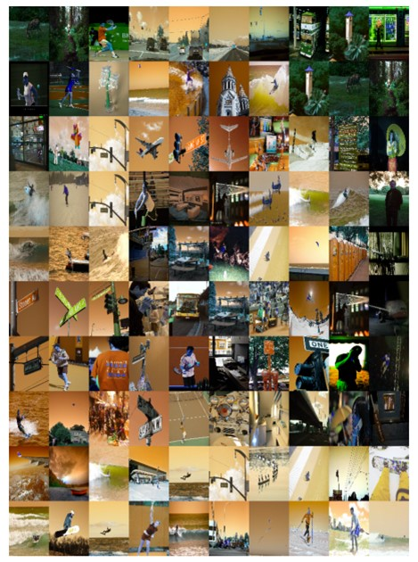
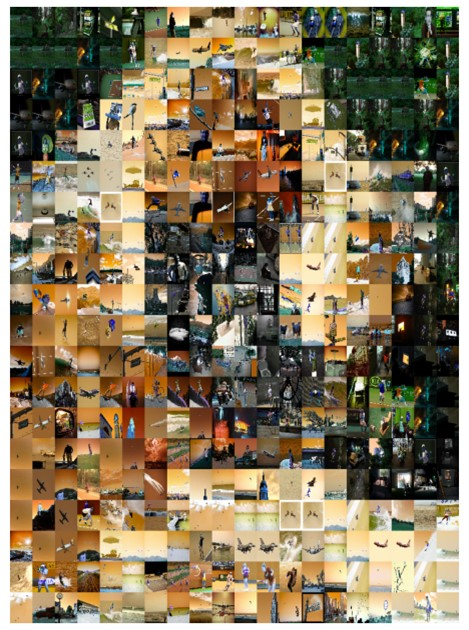
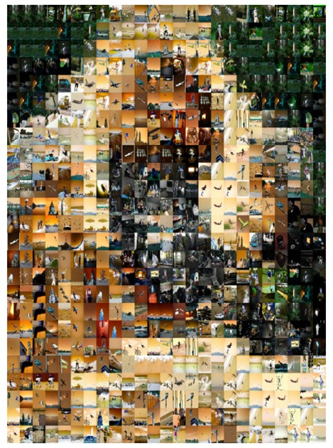

# Photographic Mosaic Creation

## Overview
This project explores the blend of computational photography and computer vision through the creation of photographic mosaics. The objective is to reconstruct a target image using smaller image tiles, ensuring both artistic appeal and computational efficiency. Core techniques like **color matching**, **adaptive tiling**, and **blending** are utilized to create detailed mosaics. 

<div align="center">
  
  <p><b>Sample Input Image</b></p>
</div>

**Output Mosaics:**

<div align="center">
  <table>
    <tr>
      <td align="center">
        <br>
        <b>10x10 Grid</b>
      </td>
      <td align="center">
        <br>
        <b>20x20 Grid</b>
      </td>
    </tr>
    <tr>
      <td align="center">
        <br>
        <b>25x25 Grid</b>
      </td>
      <td align="center">
        <br>
        <b>50x50 Grid</b>
      </td>
    </tr>
  </table>
</div>


## 🔬 Implementation Pipeline

### 1. Data Preprocessing 
- **Tile Data Preparation**:
  - Extracts average color features from tile images.
  - Saves preprocessed data into a CSV for quick access.
- **Target Image Preparation**:
  - Segments the target image into grids, ensuring compatibility with tile data.

### 2. Mosaic Generation 
- **Grid Division**:
  - Divides the target image into cells (e.g., 10x10 grid for `Lion_10x10`).
  - Computes average colors for each grid cell as the foundation for tile matching.
- **Tile Matching and Diversity**:
  - Finds the closest matching tiles based on advanced vectorized calculations.
  - Enforces diversity rules to minimize repetition and enhance visual interest.
- **Adaptive Tiling**:
  - Adjusts tile sizes dynamically based on the image's detail map, balancing fine detail and efficiency.
- **Advanced Blending**:
  - Integrates tiles seamlessly using alpha and Poisson blending for realistic effects.

### 3. Output Variations
- **Grid Configurations**: Supports grids like 10x10, 20x20, 25x25, and 50x50.
- **Adaptive Mosaics**: Leverages edge detection for detail-aware tiling.

---

## 🛠️ Key Features
- **Color Matching**: Ensures accurate tile-to-target alignment through distance metrics.
- **Adaptive Tiling**: Balances aesthetic quality by scaling tiles to match detail intensity.
- **Seamless Blending**: Applies Poisson and alpha blending to eliminate visual seams.
- **Tile Diversity**: Reduces redundancy by tracking tile usage dynamically.
- **Efficiency**: Combines vectorized operations with multi-threading for optimal performance.

---

## 🌎 Code Implementation Highlights
- **Dynamic Grid Division**:
  - Efficiently divides the target image and calculates average colors for tiles.

- **Tile Matching Algorithm**:
  - Implements fast vectorized distance computation.
  - Enforces diversity constraints for improved output quality.

- **Adaptive Tiling**:
  - Creates a detail map using edge detection.
  - Adjusts grid cells dynamically to preserve intricate details.

- **Blending Techniques**:
  - **Alpha Blending**: Smoothly combines tiles with their surroundings.
  - **Poisson Blending**: Achieves realistic tile integration using seamless cloning.

---

## 📓 Resources Used
- **Datasets**:
  - [COCO Dataset](https://cocodataset.org/)

- **Libraries**:
  - OpenCV
  - NumPy
  - Matplotlib
  - PIL (Python Imaging Library)
  - Pandas
  - TQDM (for progress tracking)

---

## 🗂️ Repository Structure
```
Photographic-Mosaic-Creation/
|-- Code/
|   |-- Final Portrait/
|   |   |-- Final_10x10.ipynb
|   |   |-- Final_20x20.ipynb
|   |   |-- Final_25x25.ipynb
|   |   |-- Final_50x50.ipynb
|   |-- Lake/
|   |   |-- Lake_10x10.ipynb
|   |   |-- Lake_20x20.ipynb
|   |   |-- Lake_25x25.ipynb
|   |   |-- Lake_50x50.ipynb
|   |-- Lion/
|   |   |-- Lion_10x10.ipynb
|   |   |-- Lion_20x20.ipynb
|   |   |-- Lion_25x25.ipynb
|   |   |-- Lion_50x50.ipynb
|   |-- Data Preprocessing.ipynb
|-- README.md
|-- Report.pdf
```

---

## 🔧 How to Run
1. Clone the repository:
   ```bash
   git clone https://github.com/amaanaijazsheikh/Photographic-Mosaic-Creation-CS445
   ```
2. Navigate to the `Code` folder and open the desired Jupyter Notebook.
3. Execute the notebooks step by step:
   - **Data Preprocessing.ipynb**: Prepare tile and target image data.
   - **Lion_10x10.ipynb** (or other grid-specific notebooks): Generate mosaics.

---

## ⚙️ Future Work
-  Expanding tile datasets for broader diversity.
-  Integration of adaptive techniques into larger-scale mosaics.

---

## 👤 Contributors
- **Amaan Aijaz Sheikh** ([asheikh4@illinois.edu](mailto:asheikh4@illinois.edu))
- **Imaad Zaffar Khan** ([izkhan2@illinois.edu](mailto:izkhan2@illinois.edu))

